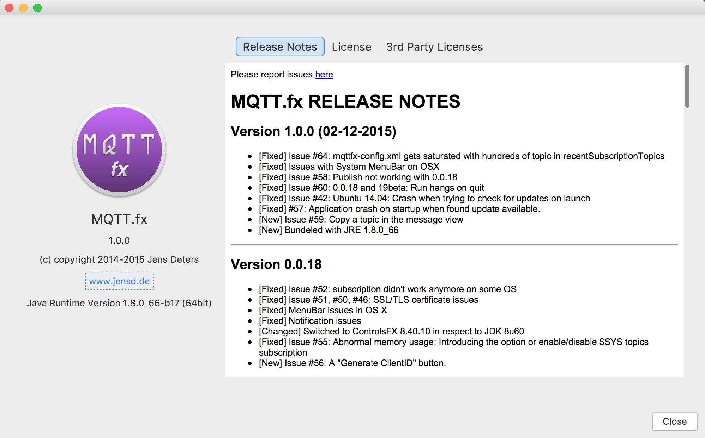

# MQTT.fx 1.0.0
*Rev.1.0*

MQTT.fx aims to be an quick and easy to use desktop tool for MQTT debugging and testing.
Since about 2 years it is continuously extended (and bug-fixed) by [Jens Deters](http://www.jensd.de).

Recently version 1.0.0 was released, including:

* Connection Profiles for different setup of MQTT broker connections
* ad-hoc connections
* publish / subscribe
* username/password authentication 
* SSL/TLS support
* clipboard for predefined messages
* $SYS-Topics / Broker Status (HiveMQ & mosquitto)
* proxy-support
* stored history of last used topics (per profile)
* Scripting support via Nashorn Engine
* logging console
* bundled installers for all platforms
* update check
* Free! (Apache 2.0 license)

MQTT.fx is the recommended tool for **Amazon Web Services** IoT [quickstart](http://docs.aws.amazon.com/iot/latest/developerguide/verify-pub-sub.html).

Furthermore there is a tutorial by *Lady Ada* to use MQTT.fx as 
[Desktop MQTT Client]( 
https://learn.adafruit.com/desktop-mqtt-client-for-adafruit-io/overview) for **Adafruit.io**.

**Website:** www.mqttfx.org

**Twitter:** @mqtt_fx

 

