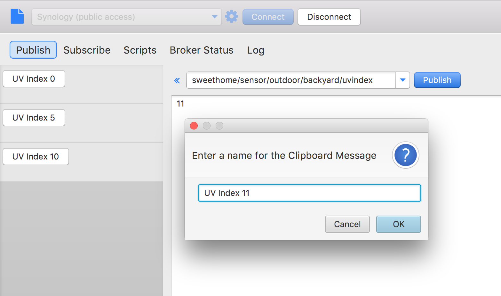

# MQTT.fx 1.0.0
*Rev.1.0*

MQTT.fx aims to be an quick and easy to use desktop tool for MQTT debugging and testing.
Since about 2 years it is continuously extended (and bug-fixed) by [Jens Deters](http://www.jensd.de).

Recently version 1.0.0 was released, including:

* Connection Profiles for different setup of MQTT broker connections
* ad-hoc connections
* publish / subscribe
* username/password authentication 
* SSL/TLS support
* clipboard for predefined messages
* $SYS-Topics / Broker Status (HiveMQ & mosquitto)
* proxy-support
* stored history of last used topics (per profile)
* Scripting support via Nashorn Engine
* logging console
* bundled installers for all platforms
* update check
* Free! (Apache 2.0 license)

MQTT.fx is the recommended tool for **Amazon Web Services** IoT [quickstart](http://docs.aws.amazon.com/iot/latest/developerguide/verify-pub-sub.html).

Furthermore there is a tutorial by *Lady Ada* to use MQTT.fx as 
[Desktop MQTT Client]( 
https://learn.adafruit.com/desktop-mqtt-client-for-adafruit-io/overview) for **Adafruit.io**.

**Website:** www.mqttfx.org

**Twitter:** @mqtt_fx

## Connection Profiles

## Broker Connection
To connect to a broker there are basically two options: ad-hoc or via the profile.
The ad-hoc connection allows to establish a broker connection by the entered host address and port to connect via profile the connection is made based on the chosen profile.

## Publish
Messages are published via the „Publish“ tab.
Once the broker connection is established, the topic to publish can simply be entered in the drop-down field. The big text area contains the message body a click in „Submit“ sends the message to the broker.

Messages can also be stored by name on a clipboard for re-usage.
A stored message is then send my just a click on the named button.
[Intro Clip](https://youtu.be/Q9yGHCTWxm8)

## Subscribe
Topic subscriptions can be made via the „Subscribe“ tab. Like in the „Publish“ context,  the wanted topics is to be entered in the drop-down-field and subscription is done via the „Subscribe“ button.

Subscribed topics are stored in the application configuration for later usage and can me chosen from the drop-dow list. 
Registered topics are listed on the left in the „Subscribe“ tab and can be unsubscribed by click on the „-“ icon (or by being selected and a click on „Unsubscribe“).
For better identification a color can be set for each topic. Received messages are colored according to the chosen topic color.

## Scripts
MQTT.fx has a scripting interfaces to allow programmed MQTT message handling via the Java8 Nashorn JavaScript Engine. The scripting is dedicated to e.g. simulate published sensor data.
The current API of the provided „mqttManager“ supports publish(), subscribe(), unsubscribe(), Logging and output to the console.

## Broker Status
Some brokers are supporting sending messages to a certain topic hierarchy stating with „$SYS“ to provide internal status information like via „$SYS/broker/version“ the broker version can be get or the broker uptime is provided via „$SYS/broker/timestamp“.
Currently MQTT.fx supports HiveMQ and mosquitto.

## Log
The „Log“ tab shows the logging console.
The same information is also written to the mqttfx.log file located in the application configuration folder.

## Download and Installation
Bundled installation packages for **Mac OSX**, **Windows** and **Linux** are available at [http://www.mqttfx.org](http://www.mqttfx.org).

"Bundled" means, the Java Runtime Environment to run the application is already included by the Installer, so no pre-installed JRE is needed. The bundles JRE is used only to run MQTT.fx. It is not installed on the System.

 
## Updates
The application is checking for available updates during start-up and prompting the user:

Loadable packages are listed, loaded and installed via the download dialog:

## About the Author
Jens Deters started with (home-) computing about 25 years ago. During the last 15 years he owned several roles in the IT & Telecommunication sector (Software Developer, Trainer, Consultant, Project Manager and Product Manager).

His major passion is still developing software. Today he works as a Senior IT Consultant and at codecentric in Germany. He regularly blogs about his projects to contribute to the JavaFX- and IoT-Community ([www.jensd.de](www.jensd.de), [www.mqttfx.org](www.mqttfx.org)). Jens is also member of the NetBeans Dream Team.

