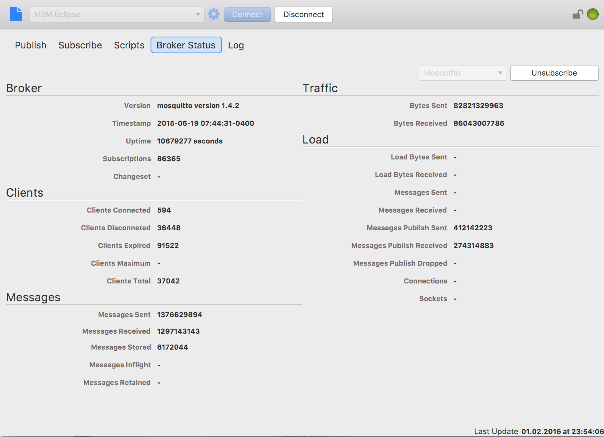

# Broker Status View

Some brokers are supporting sending messages to a certain topic hierarchy stating with „$SYS“ to provide internal status information like via „$SYS/broker/version“ the broker version can be get or the broker uptime is provided via „$SYS/broker/timestamp“.  
Currently MQTT.fx supports HiveMQ and mosquitto.

