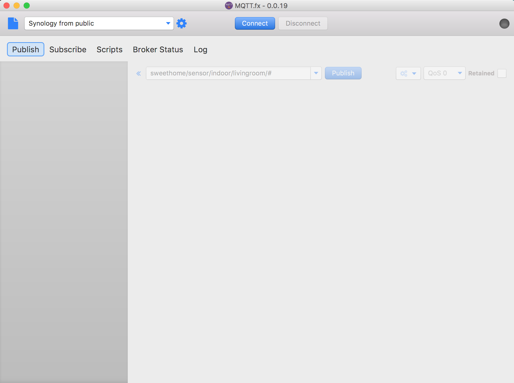

# MQTT.fx

Die GUI stellt oberen Bereich Funktionen zur Wahl eines Verbindungsprofites, sowie Connect und Disponent Buttons bereit.
Für die einzelnen Anwendungsfälle gibt es jeweils Tabs, die sich per Drag&Drop auch vom Hauptfenster in separate Fenster lösen lassen. Damit kann z. B. ein „Publish“-Fenster neben ein „Subscribe“-Fenster gestellt werden. Wird ein solches Fenster geschlossen, kehrt das Tab wieder an seine ursprüngliche Position zurück. 

