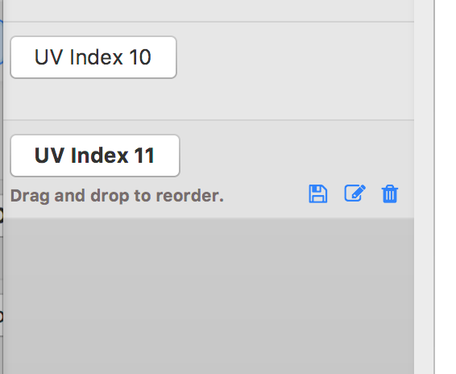

# Publish Messages

Messages are published via the „Publish“ tab.  
Once the broker connection is established, the topic to publish can simply be entered in the drop-down field. The big text area contains the message body a click in „Submit“ sends the message to the broker.

## Pre defined messages

Messages can also be stored by name on a clipboard for re-usage.  
A stored message is then send my just a click on the named button.  
[Intro Clip](https://youtu.be/Q9yGHCTWxm8)

