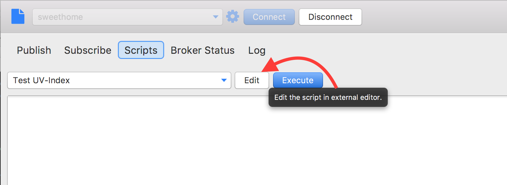
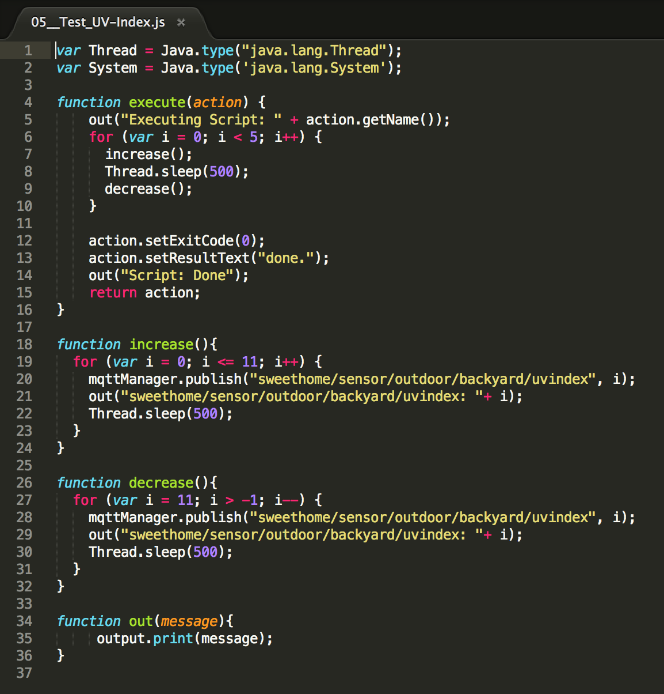
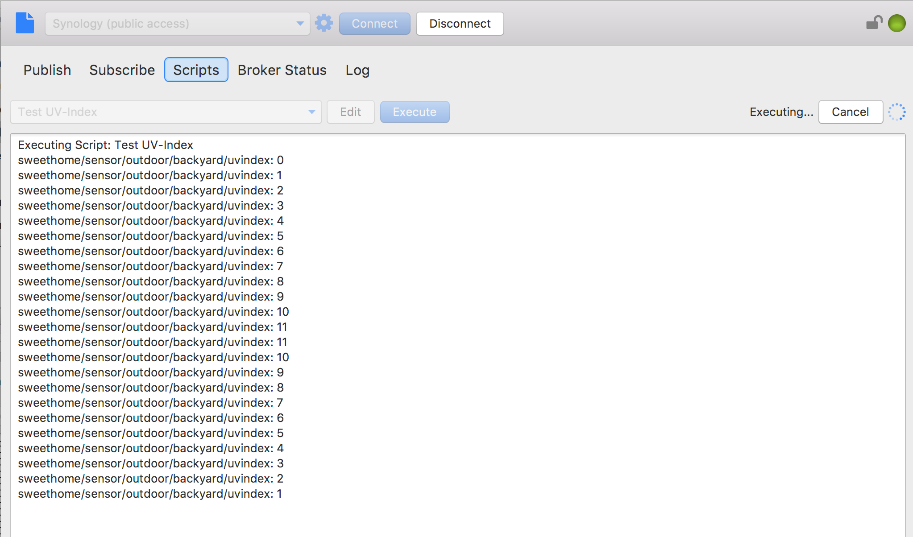

# Scripts
MQTT.fx has a scripting interfaces to allow programmed MQTT message handling via the Java8 Nashorn JavaScript Engine. The scripting is dedicated to e.g. simulate published sensor data.
The current API of the provided „mqttManager“ supports publish(), subscribe(), unsubscribe(), Logging and output to the console.

