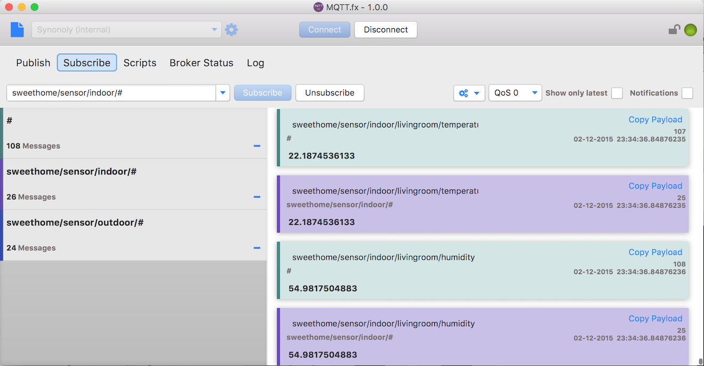

# Subscribe to Topics

Topic subscriptions can be made via the „Subscribe“ tab. Like in the „Publish“ context,  the wanted topics is to be entered in the drop-down-field and subscription is done via the „Subscribe“ button.

Subscribed topics are stored in the application configuration for later usage and can me chosen from the drop-dow list.   
Registered topics are listed on the left in the „Subscribe“ tab and can be unsubscribed by click on the „-“ icon \(or by being selected and a click on „Unsubscribe“\).  
For better identification a color can be set for each topic. Received messages are colored according to the chosen topic color.

